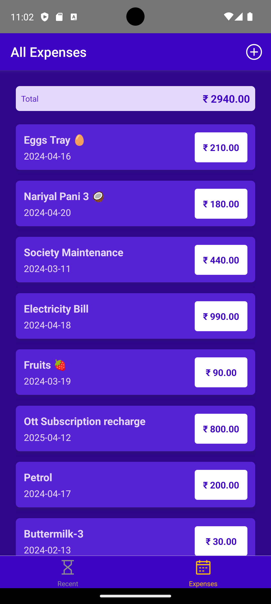
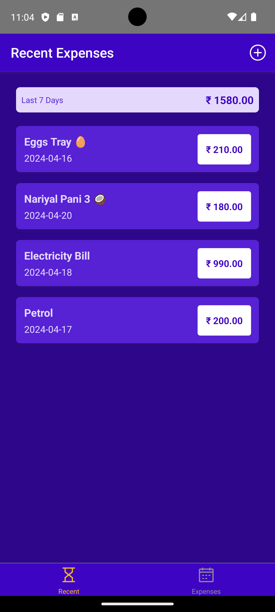
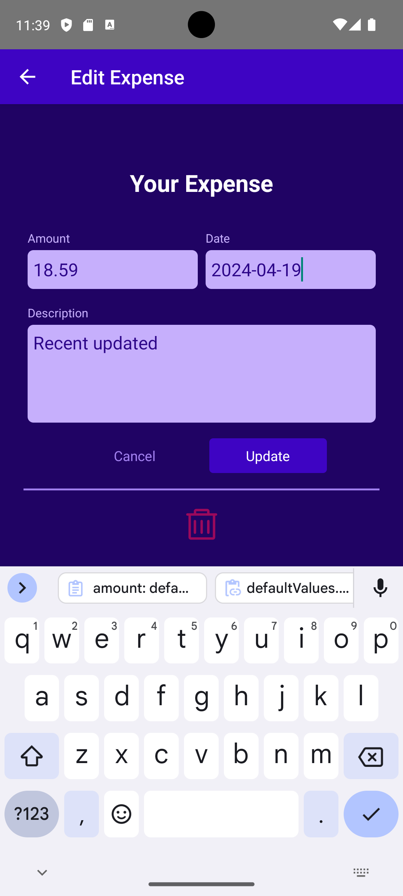
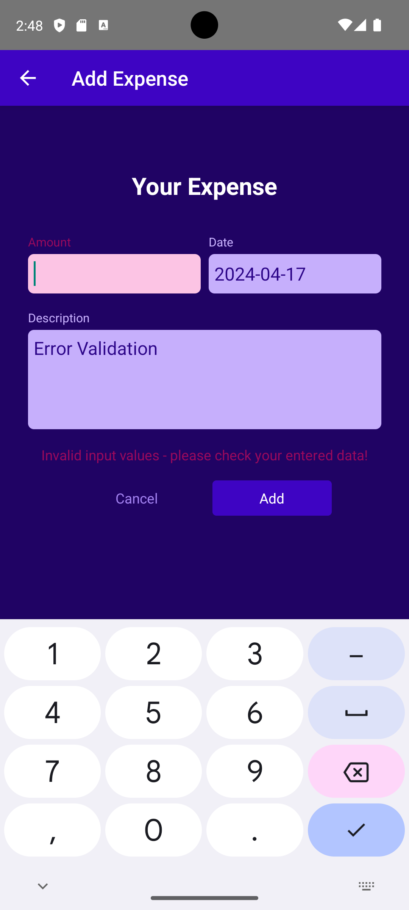

# Expense Manager

A user-friendly mobile application built with React Native to help you effortlessly track and manage your finances. 

This is a new [**React Native**](https://reactnative.dev) project, bootstrapped using [`@react-native-community/cli`](https://github.com/react-native-community/cli).

## Features
- **Clear Overview- Recent Expenses**: Gain instant insights into your spending habits with a comprehensive recent expenses list at the app's forefront.
- **Complete Expense History - All Expenses**: Access a detailed record of all your expenses for thorough financial analysis.
- **Effortless Expense Management -  Add new expenses - edit existing**: Add new expenses and seamlessly edit existing ones, empowering you to stay on top of your finances.
- **Robust Input Validation** : Experience a smooth user experience with intelligent input validation that prevents errors and ensures data integrity.
- **Nested Navigation**: (**Native Stack**, **Bottom-Tab**, **Stack** ) 
- **Store Data Management**
- **Efficient Data Handling - Firebase** -  Leverage the power of Firebase, a robust backend cloud solution, for persistent storage of your expense data, guaranteeing its accessibility across devices.
- **Enhanced User Experience - spinner loader**: Enjoy a smooth and responsive user interface with a spinner loader that displays during data fetching, keeping you informed during the process.
- Custom Pressable Button Component
- FlatList for displaying your expenses lists
- Utilizes latest JavaScript and React features
- Styled with React Native StyleSheet
- Implemented using React Hooks
- Cross-platform code for Android and iOS
- Latest features of JavaScript i.e. ES8 is used


### Few Screenshots

   


# Getting Started

>**Note**: Make sure you have completed the [React Native - Environment Setup](https://reactnative.dev/docs/environment-setup) instructions till "Creating a new application" step, before proceeding.

## Step 1: Start the Metro Server

First, you will need to start **Metro**, the JavaScript _bundler_ that ships _with_ React Native.

To start Metro, run the following command from the _root_ of your React Native project:

```bash
# using npm
npm start

# OR using Yarn
yarn start
```

## Step 2: Start your Application

Let Metro Bundler run in its _own_ terminal. Open a _new_ terminal from the _root_ of your React Native project. Run the following command to start your _Android_ or _iOS_ app:

### For Android

```bash
# using npm
npm run android

# OR using Yarn
yarn android
```

### For iOS

```bash
# using npm
npm run ios

# OR using Yarn
yarn ios
```

If everything is set up _correctly_, you should see your new app running in your _Android Emulator_ or _iOS Simulator_ shortly provided you have set up your emulator/simulator correctly.

This is one way to run your app — you can also run it directly from within Android Studio and Xcode respectively.
